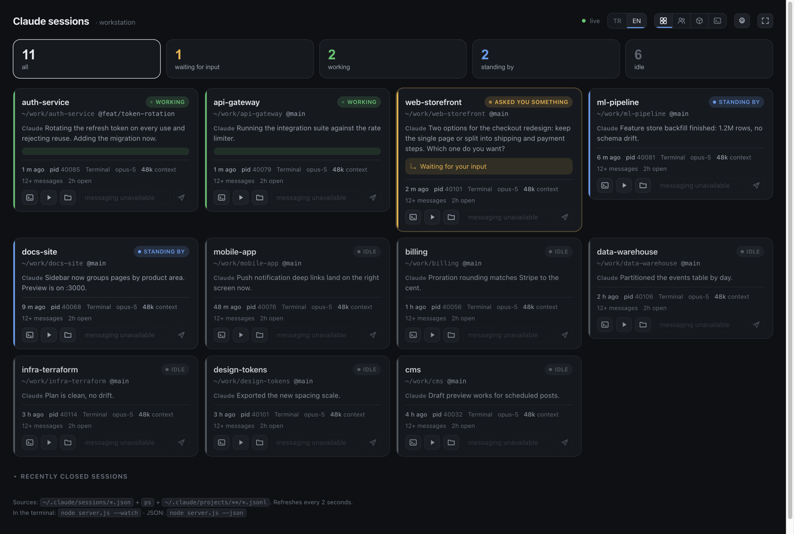
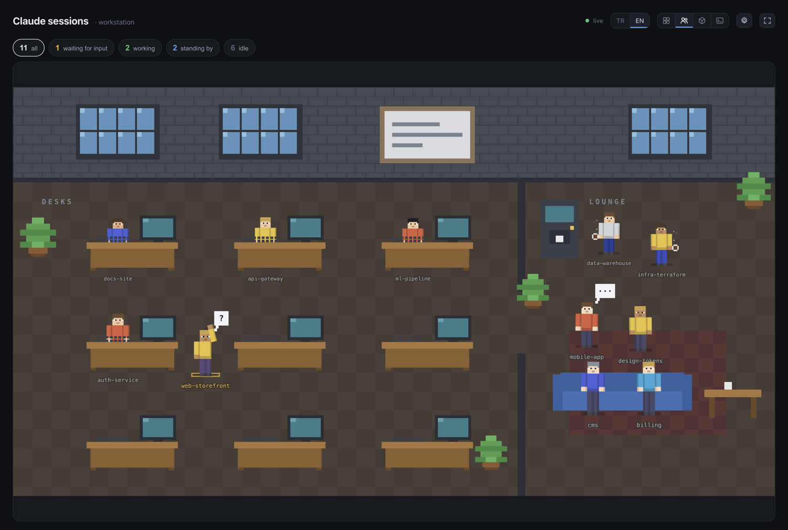

# ccwatch

> 🇹🇷 [Türkçe README](README.tr.md)

A local dashboard for every Claude Code CLI session running on your machine: how many there are,
which folder each one is in, which is working, which has gone quiet — and **which one is waiting
for you to type something**.

No dependencies, no network access, no telemetry. Just Node and the files Claude Code already
writes on your disk.



Or, if you would rather see your sessions as an office:



People at desks are working, the one with a raised hand needs your input, and the ones on the
sofa have been idle for a while. Status changes make them walk — through the door, not the wall.

---

## Install

```bash
git clone https://github.com/ferhatural/ccwatch.git
cd ccwatch
node server.js
```

Opens `http://localhost:7788`. Node 18+ is enough. There is nothing to install.

```bash
node server.js            # web dashboard (default)
node server.js --watch    # live table in the terminal, refreshes every 2s
node server.js --once     # print the table once and exit
node server.js --json     # raw JSON, for scripting
node server.js --port 7799 --no-open
```

To call it from anywhere:

```bash
ln -s "$PWD/server.js" /usr/local/bin/ccwatch
```

## Menu bar app (macOS)

If you would rather have it in the menu bar than in a browser tab, there is an Electron wrapper.
Click the icon and the one window opens; click again and it goes away. The icon turns amber and
grows a number the moment a session starts waiting on you.

On a new machine there is nothing to clone and nothing to build:

```bash
curl -fsSL https://raw.githubusercontent.com/ferhatural/ccwatch/main/install.sh | bash
```

That picks the DMG for your architecture from the latest release, copies the app into
`/Applications`, and opens it. The app bundles its own Node, so nothing else is needed.

Or [download the DMG](https://github.com/ferhatural/ccwatch/releases/latest) and drag it across
by hand. In that case run this once, or macOS will refuse to open it:

```bash
xattr -dr com.apple.quarantine /Applications/ccwatch.app
```

The app is not signed — that needs a paid Apple Developer account — and macOS quarantines
unsigned apps that arrive from a browser. `install.sh` clears the flag for you; a manual
download needs the line above. If you have an account, build it signed yourself.

To work on it instead of just using it:

```bash
npm install            # electron, dev dependency only — `node server.js` still needs nothing
npm run app            # run it
npm run app:build      # dist/ccwatch-1.0.0-arm64.dmg
```

Releases are built by `.github/workflows/release.yml` on a version tag:

```bash
npm version 1.1.0 && git push --follow-tags
```

The app starts `server.js` itself as a child process, so there is nothing else to keep running.
If a ccwatch server of the same version is already up on port 7788 — from `--install` below, or
a terminal — it adopts that one instead of starting a second. A server of a *different* version
is not adopted: a launchd agent that has been up for days keeps serving the code it started
with, which shows up as features mysteriously missing from the dashboard. In that case the app
starts its own on the next free port and says so on stderr.

The dock icon comes and goes with the window: while the window is open the app is a normal app
and ⌘Tab reaches it; once you hide the window it drops out of the dock and the app switcher and
lives only in the menu bar. Right-click the icon for open in browser, reload, **start at login**,
and quit. Closing the window (⌘W or the red button) only hides it; ⌘Q quits.

The icon is the head of the office-view character — a menu bar icon has to be a monochrome
template image, so the eyes and mouth are holes rather than pixels of their own colour.

Cards in the app get one extra button: go to the terminal tab. Terminal.app and iTerm2 both
expose a `tty` per tab in AppleScript, which is the same tty the dashboard already shows, so the
tab that session is running in comes to the front — no new tab, no new shell. Editors with a
built-in terminal (VS Code, Cursor) offer no way to select a tab, so there the button only brings
the app forward. macOS asks for permission to control the terminal the first time you use it;
because the app is unsigned that permission is tied to the exact binary, so a new DMG means being
asked once more.

The `.dmg` is unsigned, so the first launch needs right-click → Open.

## Install as a PWA (macOS)

The dashboard is also a PWA, if you prefer that: open it, then **File → Add to Dock**
in Safari, or the install button in Chrome's address bar. You get a real window, a dock icon,
and a badge with the number of sessions waiting on you.

A dock icon is only useful if the server is up, so let launchd keep it running:

```bash
ccwatch --install      # start at login, restart on crash
ccwatch --status       # is it loaded? which pid? where are the logs?
ccwatch --uninstall
```

`--install` writes `~/Library/LaunchAgents/com.github.ferhatural.ccwatch.plist` and logs to
`~/Library/Logs/ccwatch.log`. Install the package globally first (`npm i -g ccwatch`) — a path
inside the `npx` cache can be cleaned up later and would break the agent.

## Statuses

| Status | Meaning |
|---|---|
| **waiting for input** (amber) | Claude asked you something or needs a permission decision — the keyboard is yours |
| **asked you something** (amber) | The turn is over and Claude's last message ends in a question. Claude Code files that as `idle`, so this one is ours, not its |
| **working** (green) | Thinking or running a tool; the card shows which tool and its argument |
| **standing by** (blue) | Claude answered and it is your turn — there was activity in the last 15 minutes |
| **idle** (grey) | Quiet for more than 15 minutes |
| **unknown** | Process is alive but publishes no status (older versions, or a child process) |
| **ended** | Process is gone but the transcript is there — resume it with `claude --resume <id>` |

Claude Code writes `idle` the instant a turn ends, so a five-second-old session and a
three-day-old one look identical in the raw data. That is why `idle` is split in two here.
The threshold is `COLD_MS` in `server.js`.

## Where the data comes from

| Source | What it gives |
|---|---|
| `~/.claude/sessions/<pid>.json` | Live status (`busy` / `waiting` / `idle`), `waitingFor`, cwd, session id, version |
| `ps -axo …` | Whether the process is actually alive, its tty, CPU/RAM, and which app it runs under |
| `~/.claude/projects/**/<sessionId>.jsonl` | Claude's last message, your last prompt, the running tool, model, context size, git branch |

Status comes from the session file first — that is Claude Code's own bookkeeping and the most
reliable source. When a session file has no `status` field (older versions do not write one),
the status is inferred from the tail of the transcript and the card says so.

Stale `sessions/*.json` files belonging to dead PIDs are ignored; only processes that are really
running count as live.

Two details worth knowing if you plan to hack on this:

- **The transcript file's mtime is not a reliable activity signal.** It gets touched without a new
  message arriving. The real measure is the timestamp of the last event *inside* the file.
- The card's main line is **Claude's last message** (markdown stripped). Your own prompt and the
  conversation's topic title are in the tooltip — you already know what you typed; what you want
  to see at a glance is the answer.

## Sending messages to a session

If a session has a messaging socket, its card gets a text box that writes a line of JSON to
`/tmp/cc-socks/<pid>.sock`. Claude Code listens there:

```bash
echo '{"type":"user","message":{"role":"user","content":"hello"}}' \
  | socat - UNIX-CONNECT:/tmp/cc-socks/12345.sock
```

Two things to expect:

1. **The message arrives framed as coming from another Claude session**, not as something you
   typed. It cannot approve a pending permission prompt — the protocol explicitly refuses that.
2. **The socket only exists if the session was started with it.** It is created once at startup
   behind a feature flag, and you cannot attach one to a running process afterwards. Cards without
   a socket show the box greyed out with the reason in the tooltip.

To guarantee the socket for every new session:

```bash
echo 'export CLAUDE_CODE_HARBOR_KITE=1' >> ~/.zshrc
```

Then open a new terminal. Existing sessions have to be restarted (`claude --resume <id>` keeps
the conversation) before they get one.

## Dashboard

- Live updates over SSE every 2 seconds; the browser tab title shows how many sessions want you
- Optional desktop notification the moment a session starts waiting for input
- Click a status tile to filter
- Column count is selectable (auto, 1–6) and remembered; single column on narrow screens;
  fullscreen button in the corner
- Icon buttons on every card copy `claude --resume <id>`, `cd <folder>`, or the transcript path
- Sessions an editor started but never used are hidden by default
- **TR / EN switch** in the top right. It changes the interface only — Claude's messages, project
  names, tool names and paths are data and are never translated. The default follows your browser's
  language list and your choice is remembered.

## Office view

The 👥 button in the top right toggles between cards and a 2D office (the choice is remembered).
Everything is drawn as inline SVG in Minecraft-ish pixel style — characters are built from sprite
maps at Steve proportions (8×8 head, 4×12 arms), the scene from block patterns.

- **working** — behind their own desk, head down
- **waiting for input** — standing beside the desk, facing you, hand up, `?` above their head
- **standing by** — still at the desk, not yet cold
- **idle** — in the lounge: on the sofa, holding coffee, or gossiping in pairs

When a session's status changes the character walks to its new spot: legs and arms swing in a
two-frame step, the duration scales with distance, and crossing between the office and the lounge
routes through the doorway. Slots are sticky, so one person leaving does not shuffle everyone else.
All animation stops under `prefers-reduced-motion`.

> Implementation note: SVG has no `z-index`, so depth ordering means reordering DOM nodes — and
> moving a node cancels a running CSS transition. That is why the reorder happens only when the
> order actually changed, and always *before* any movement starts.

## Notes and limits

- Read-only by design apart from the message box. It never kills or restarts a session.
- Binds to `127.0.0.1` only. `POST /api/send` additionally rejects foreign `Origin` headers.
- Written for macOS: it parses BSD `ps` and `lsof` output. Linux should mostly work but the `ps`
  line parsing deserves a review first.
- It leans on Claude Code internals (`~/.claude/sessions`, the transcript format, the messaging
  socket) that are undocumented and may change between versions. If a release breaks something
  here, that is why.
- The interface ships in English and Turkish. Adding a language means one more entry in the `I18N`
  dictionary at the top of the script block in `index.html`.

## License

MIT
